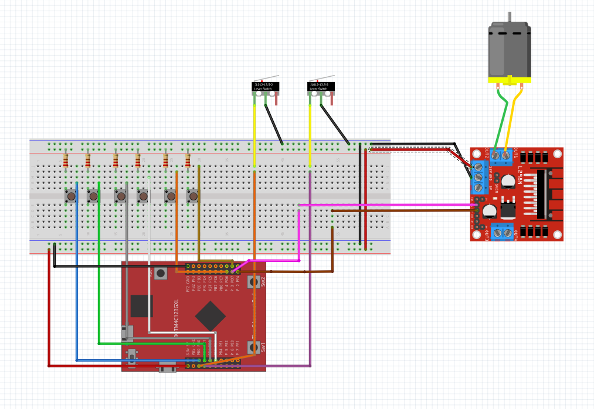

# Power Window Control System using Tiva C and FreeRTOS

## Project Scope

This project involves the development of a power window control system for the front passenger door of a car, featuring both passenger and driver control panels. The implementation must leverage FreeRTOS for real-time operating system functionality.

## System Architecture Diagram

### Key Features

1. **Manual Open/Close Function**: 
   - The window opens or closes as long as the power window switch is continuously pressed or pulled.
2. **One-Touch Auto Open/Close Function**:
   - A short press of the power window switch fully opens or closes the window.
3. **Window Lock Function**:
   - When activated, this function disables the operation of all windows except the driver's window.
4. **Jam Protection Function**:
   - Automatically stops and reverses the window if an obstacle is detected during one-touch auto close.

## Hardware Components:

   - Tiva C microcontroller
   - Top and bottom limit switches to prevent the window from exceeding its bounds.
   - DC motor to drive the window mechanism.
   - Push buttons for window operation on both passenger and driver sides.
   - ON/OFF switch to enable/disable the passenger panel from the driver panel.

## Usage Instructions

1. **Manual Mode**:
   - Press and hold the window switch to open or close the window.
   - Release the switch to stop the window movement.

2. **One-Touch Mode**:
   - Press the window switch briefly to fully open or close the window automatically.

3. **Window Lock**:
   - Activate the window lock switch to disable the passenger window controls.

4. **Jam Protection**:
   - Press the obstacle detection button to simulate an obstruction; the window should stop and reverse for about 0.5 seconds.

## Project Implementation

The control logic is implemented using a Finite State Machine (FSM), with transitions based on the inputs from switches and buttons. The project uses FreeRTOS features such as queues, semaphores, and mutexes for task synchronization and resource management.

### Finite State Machine (FSM)

The FSM transitions between states such as `IDLE`, `MOVING_UP`, `MOVING_DOWN`, `AUTO_UP`, `AUTO_DOWN`, and `JAM_PROTECTION` based on the input conditions.

## Contribution Guidelines

We welcome contributions from the community. If you want to contribute:

1. Fork the repository.
2. Create a new branch (`git checkout -b feature-branch`).
3. Make your changes and commit them (`git commit -m 'Add new feature'`).
4. Push to the branch (`git push origin feature-branch`).
5. Create a Pull Request.
